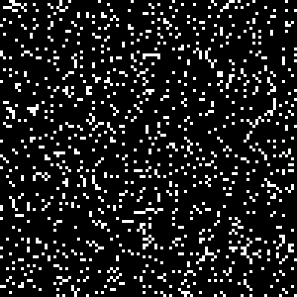
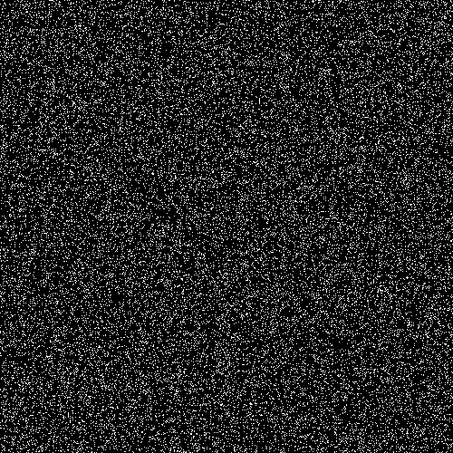

# automata

A small program written for fun, which runs 2D cellular automata models and saves the output as a gif image. The gif generation code was implemented following [Matthew Flickinger's excellent guide to the gif format](http://www.matthewflickinger.com/lab/whatsinagif/bits_and_bytes.asp).

Currently the only model implemented is Conway's Game of Life, which can be started either with a random selection of cells or with a single glider.

## Examples

## Usage 
Build the project using CMake, then run as follows:

     automata <filename> <model> <number of frames> <scale> <grid width> <grid height>  <model specific options>

Arguments:
- `filename` - The name of the gif file to be generated.
- `model` - The model to be run.  Current options:
  * `conway-glider` - Starts a single glider in the top left corner.
  * `conway-random` - Starts a random selection of live cells.
- `number of frames` - How many steps of the model will be in the final gif.
- `scale` - How many pixels per model cell in the generated gif.
- `grid width` - Number of cells along the x axis of the model.
- `grid height` - Number of cells along the y axis of the model.
- `model specific options` - Arguments specific to the chosen model:
  - `conway-glider`: No additional arguments
  - `conway-random`: One argument, value `0-255`, which determines the probability for a cell to be live.

